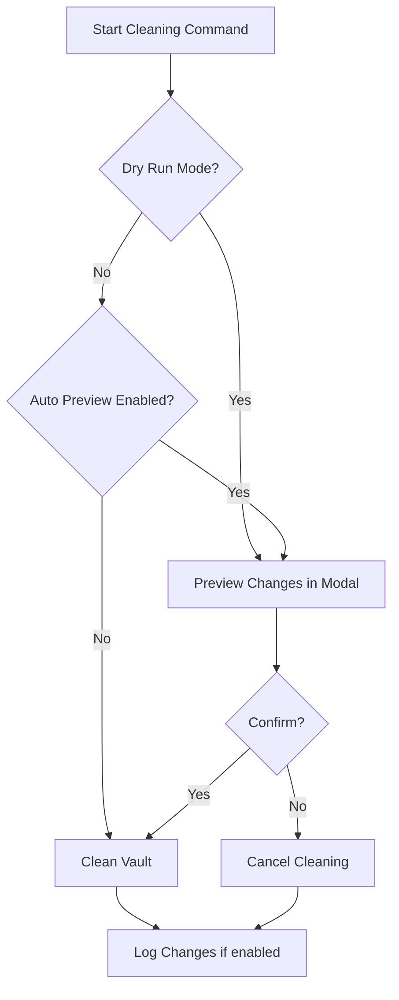

# Clean Links Plugin for Obsidian

Clean Links is an Obsidian.md plugin that automatically removes tracking parameters from URLs in your vault. It works on existing notes, newly pasted content, and provides previews before modifying anything.

This keeps your notes clean, concise, and free from unnecessary tracking codes like `?utm_source=` or `?fbclid=`.

---

## Features

* **Vault-wide cleaning** – Remove tracking parameters from all Markdown notes.
* **Per-note cleaning** – Clean the current note with one command.
* **Preview mode** – Preview changes in a scrollable modal before modifying any files.
* **Dry run mode** – Show all links that would be cleaned without modifying files.
* **Paste cleaning** – Automatically clean URLs when pasting content into a note.
* **Modifier-key paste** – Paste without cleaning by holding **Shift**.
* **Undo-aware paste** – Optionally restore the original clipboard URL when undoing a cleaned paste.
* **File menu** – Clean links in the current note directly from the file menu.
* **Logging** – Optional log file with `[[Wiki-links]]`, clickable URLs, and summary counts.
* **Auto-preview toggle** – Automatically preview changes before cleaning the vault.

---

## Installation

1. Download the latest release from the [GitHub repository](#).
2. Extract the plugin folder to your Obsidian vault under `.obsidian/plugins/clean-links`.
3. Enable the plugin in **Settings → Community Plugins**.

---

## Commands

| Command                                             | Description                                                                                     |
| --------------------------------------------------- | ----------------------------------------------------------------------------------------------- |
| Clean tracking parameters from all links in vault   | Cleans all notes in the vault.                                                                  |
| Clean tracking parameters from current note         | Cleans only the currently active note.                                                          |
| Preview links that would be cleaned in current note | Shows a dry-run preview for the current note.                                                   |
| Preview links that would be cleaned in vault        | Shows a dry-run preview for the vault.                                                          |
| Preview vault (dry-run, show all links to clean)    | Shows all links in the vault that would be cleaned without modifying any files.                 |
| Preview and clean vault links                       | Automatically previews the vault, then cleans links based on dry-run and auto-preview settings. |

---

## Usage

### Cleaning a Single Note

1. Open the note you want to clean.
2. Open the command palette (`Cmd/Ctrl + P`).
3. Select **Clean tracking parameters from current note**.

### Cleaning the Entire Vault

1. Open the command palette.
2. Select **Clean tracking parameters from all links in vault**.
3. If auto-preview is enabled, you will see a preview in a modal before the vault is cleaned.

---

## Preview Mode

* Previews now open in a **scrollable modal with a textarea**.
* Text does **not wrap**, preserving original URL formatting.
* Includes a **Copy to Clipboard** button for easy copying.
* Dry-run previews show **plain URLs only**, without Markdown links.
* Works for **single-note** and **vault-wide** previews.

---

## Paste Cleaning

* URLs pasted into notes are automatically cleaned.
* Modifier-key paste allows bypassing cleaning: **Shift**, **Cmd/Ctrl**, or **Alt** + paste.

**Example:**

Clipboard content:

```
https://example.com/?utm_source=newsletter&utm_medium=email
```

* Normal paste →

```
https://example.com/
```

* Paste with modifier →

```
https://example.com/?utm_source=newsletter&utm_medium=email
```

---

## Undo-Aware Paste (Optional)

* When enabled, undo after a cleaned paste restores the **original clipboard URL** with tracking parameters.
* Can be toggled in settings (**Restore original URL on undo**).

**Behavior:**

| Setting  | Ctrl/Cmd+Z after paste                |
| -------- | ------------------------------------- |
| Enabled  | Original clipboard URL restored       |
| Disabled | Undo restores previous editor content |

---

## Settings

Access settings in **Settings → Community Plugins → Clean Links**:

* **Tracking parameters** – Customize which URL parameters to remove (comma-separated).
* **Dry run mode** – Enable to preview changes without modifying files.
* **Log to file** – Enable logging of previews and clean operations.
* **Log file name** – Specify the filename for logs (default: `CleanLinks Log.md`).
* **Auto preview before cleaning** – Automatically preview vault changes before cleaning.
* **Restore original URL on undo** – When enabled, undo after a cleaned paste restores the original clipboard URL.

---

## Log File Format

When logging is enabled, entries appear like this:

```markdown
---
**2025-08-28 18:05:00** – 2 links affected
[[My Note]]:
https://example.com/?utm_source=test → https://example.com/
https://foo.com/page?utm_medium=email&bar=1 → https://foo.com/page?bar=1
```

* Logs include the **note filename** for pastes and clean operations.
* Entries show whether a paste was skipped due to a modifier key or unchanged.

---

## Right-click Context Menu

Right-click any note in the file explorer and select **Clean links in this note** to clean links without opening the note.

---

## Workflow Diagram

**Vault Cleaning Workflow:**



---

## Contribution

Contributions and suggestions are welcome! Please submit a pull request or open an issue on the GitHub repository.

---

## License

MIT License — free and open source.
