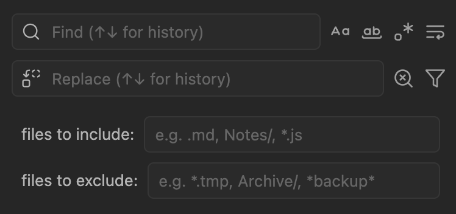

# Find-n-Replace

A vault-wide **search and replace** plugin for Obsidian. Find-n-Replace helps you locate content across your entire vault through powerful search operations, then replace matches efficiently with regex support, multi-selection capabilities, file filtering, and real-time preview.



## What This Plugin Does

**Find-n-Replace** provides a dedicated search interface that helps you find and modify content across your vault. The plugin allows you to:

1. **Filter and search** across your entire vault with file type and folder controls
2. **Preview all matches** in a structured, navigable list
3. **Select specific matches** or entire files for replacement
4. **Execute replacements** with full regex capture group support
5. **Navigate directly** to any match location with a single click
6. **Optimize performance** by limiting search scope to relevant files and folders

Unlike Obsidian's built-in search, Find-n-Replace is designed specifically for bulk editing operations across multiple files simultaneously, combining the discovery power of search with precise replacement capabilities.

> [!CAUTION]
> **This plugin directly modifies your vault files!** All replace operations permanently change file contents. While the plugin includes safety features and error handling, **you are responsible for maintaining backups of your vault**. Always ensure you have a recent backup before performing bulk replacements, especially when using regex patterns or vault-wide operations. Consider using Git version control or Obsidian's built-in sync/backup features to protect your data.

## Core Features

### Search Capabilities
- **Full-text search** across all text files in your vault (markdown, txt, js, css, json, and more)
- **Universal file type support** - works with any text-based file format by default
- **File filtering system** with extensions, folders, and glob patterns for large vault performance
- **Regular expression pattern matching** with JavaScript regex syntax
- **Case-sensitive and whole-word matching** options
- **Automatic search-as-you-type** with configurable debouncing
- **Search result limiting** to handle large vaults efficiently

### VSCode-Style File Filtering System
- **"files to include" patterns** - Limit search to specific file types, folders, or glob patterns (`.md`, `Notes/`, `*.js`)
- **"files to exclude" patterns** - Skip specific files, folders, or patterns (`*.tmp`, `Archive/`, `*backup*`)
- **Smart pattern parsing** - Automatically detects extensions vs folders vs glob patterns
- **Expandable filter panel** - VSCode-style interface with clear-input buttons
- **Session-only filters** - Changes don't modify plugin settings; settings provide defaults
- **Visual feedback** - Filter button shows active state when filters are applied

### Selection System
- Multi-select individual matches using Ctrl/Cmd+click
- Select all matches in a specific file
- Select all matches across the entire vault
- Visual selection indicators with persistent state
- **Persistent selections** - selections maintained when modifying replace text
- Keyboard shortcuts for bulk selection operations

### Replacement Operations
- Replace individual matches one at a time
- Replace all selected matches in bulk
- Replace all matches within a specific file
- Replace all matches across the entire vault
- Real-time preview showing exact replacement text before execution

### Regex Support
- Full JavaScript regular expression support
- **Multiline patterns**: Cross-line matching with `\n`, `^`, `$` anchors (requires Multiline mode)
- Capture group replacement using `$1`, `$2`, etc.
- Special replacement tokens: `$&` (full match), `$$` (literal $)
- Live preview of regex replacements with capture group expansion
- Regex validation with clear error messages

### User Interface
- Clean, focused interface optimized for find/replace workflows
- **Search History**: Navigate previous search and replace patterns using ↑↓ arrow keys (saved on Enter key press)
- **Clear-Input Buttons**: All text inputs (search, replace, include/exclude filters) feature contextual clear buttons (X icon) that appear when content is present and disappear when empty, with proper focus management
- Collapsible file groups with persistent expand/collapse state
- Adaptive toolbar that shows relevant controls contextually
- Full keyboard navigation with complete sequential tab order (toolbar → file headers → replace buttons → matches → replace buttons)
- Enhanced accessibility with larger focus targets and proper event isolation
- All replace actions accessible via keyboard navigation
- Accessible design with screen reader support and proper ARIA labeling
- **Built-in Help System**: Comprehensive help modal accessible via toolbar menu (⋯) showing all keyboard shortcuts, **complete file filtering guide with examples**, usage tips, and your personal hotkey configurations

### Performance Optimizations
- Incremental result updates after replacements (avoids full re-search)
- Intelligent regex compilation caching
- Batched file processing to maintain UI responsiveness
- Configurable result limits to prevent UI freezing
- Search operation serialization to prevent race conditions

## Installation

[Available on Obsidian.md/plugins](https://obsidian.md/plugins?search=find-n-replace)

### Community Plugins (Recommended)

> [!WARNING]
> As of 2025-10-13, this plugin has not been reviewed by Obsidian. Until then, use manual or BRAT installation.

1. Open Obsidian Settings
2. Go to Community Plugins and disable Safe Mode
3. Click Browse and search for "Find-n-Replace"
4. Install the plugin and enable it

### Manual Installation

1. Download `main.js`, `manifest.json` & `styles.css` from the latest [release](https://github.com/gapmiss/find-n-replace/releases/)
2. Create a new folder `/path/to/vault/.obsidian/plugins/find-n-replace`
3. Move all 3 files to `/path/to/vault/.obsidian/plugins/find-n-replace`
4. Settings > Community plugins > Reload plugins
5. Enable the "Find-n-Replace" plugin in the community plugin list

### Via BRAT (Beta Reviewer's Auto-update Tool):

1. Ensure the [BRAT](https://github.com/TfTHacker/obsidian42-brat) plugin is installed
2. Trigger the command Obsidian42 - BRAT: Add a beta plugin for testing
3. Enter this repository, gapmiss/find-n-replace
4. Enable the "Find-n-Replace" plugin in the community plugin list

## Documentation

📚 **Comprehensive documentation is available in the [`docs/`](docs/) directory:**

- **[Complete User Guide](docs/USER_GUIDE.md)** - Step-by-step instructions for all features with screenshots
  - Getting Started tutorials
  - Basic and advanced features explained
  - Settings configuration guide

- **[Real-World Workflows](docs/WORKFLOWS.md)** - Practical scenarios and use cases
  - Content refactoring workflows
  - Tag and metadata management
  - Link and reference updates
  - Clean-up and formatting tasks
  - Bulk editing operations

- **[Tips & Tricks](docs/TIPS_AND_TRICKS.md)** - Power user features and optimization techniques
  - Performance optimization strategies
  - Keyboard shortcut mastery
  - Advanced regex patterns
  - Common pitfalls to avoid

**Quick Start:** See the [Usage Guide](#usage-guide) below for basic operations, or dive into the [Complete User Guide](docs/USER_GUIDE.md) for comprehensive tutorials with visual examples.

## Usage Guide

### Opening the Plugin
Access via Command Palette: `Find-n-Replace: Open`

The plugin opens in a dedicated pane that can be docked anywhere in your workspace.

### Getting Help
Click the **⋯** (ellipsis) button in the toolbar and select **Help** to open the comprehensive help modal. This shows:
- All 12 available plugin commands with descriptions
- Your configured keyboard shortcuts (if any)
- Recommended hotkey combinations
- **File Filtering Guide**: Complete documentation for include/exclude patterns with real-world examples, pattern types (extensions, folders, globs), and common use cases
- Usage tips for efficient workflows including clear-input button usage
- Direct link to hotkey configuration in Obsidian settings

### Basic Search Workflow
1. **Optional**: Configure file filters using the filter button to limit search scope
2. Enter search term in the search input field (use X button to clear input when needed)
3. Press **Enter** to add to search history (use ↑↓ arrows to navigate history)
4. Results populate automatically as you type
5. Browse results organized by file
6. Click any result to navigate to that location in your vault

### 💡 Quick How-To: Searching Different File Types

**By default, the plugin searches ALL text files** (not just markdown). To search specific file types:

**Search code files only:**
1. Click the 🔍 filter button
2. In "files to include": type `.js, .ts, .css`
3. Search for your pattern (e.g., `console\.log`)

**Search config files only:**
1. Click the 🔍 filter button
2. In "files to include": type `.json, .yaml, .xml`
3. Search for your pattern (e.g., `"version"`)

**Exclude non-markdown files:**
1. Click the 🔍 filter button
2. In "files to exclude": type `*.js, *.json, *.css`
3. Now only markdown and text files will be searched

**Pro tip:** Leave filters empty to search all file types at once!

### VSCode-Style File Filtering (Performance Optimization)
Click the **🔍** filter button to open the expandable filter panel with clear-input enabled fields:

**files to include Examples:**
- `.md, .txt` - Only search markdown and text files
- `.js, .css, .json` - Only search JavaScript, CSS, and JSON files
- `Notes/, Daily/` - Only search in Notes and Daily folders
- `.md, Projects/` - Only markdown files in Projects folder
- Use the X button to quickly clear include patterns

**files to exclude Examples:**
- `*.tmp, *backup*` - Skip temporary and backup files
- `Archive/, Templates/` - Skip Archive and Templates folders
- `temp/*, *.log` - Skip temp folder and log files
- Use the X button to quickly clear exclude patterns

**Session-Only Behavior:**
- Filter changes are temporary and don't modify plugin settings
- Settings provide default values when opening the view
- Close and reopen the view to load fresh defaults

### Search Options
- **Match Case**: Enable case-sensitive searching
- **Whole Word**: Match complete words only (adds word boundaries)
- **Use Regex**: Enable regular expression pattern matching
- **Multiline**: Enable cross-line regex patterns (requires Regex mode)

### Multi-Selection
- **Ctrl/Cmd+Click**: Toggle selection of individual results
- **Ctrl/Cmd+A**: Select all visible results
- **Escape**: Clear all selections

### Replacement Options
- **Replace This**: Replace a single match (appears on hover)
- **Replace Selected**: Replace all currently selected matches
- **Replace All in File**: Replace all matches within a specific file
- **Replace All in Vault**: Replace all matches across entire vault

### File Group Management
- Click file names to expand/collapse result groups
- File states persist across search sessions
- Expand/Collapse All button in toolbar for bulk operations

## Configuration

### Plugin Settings

#### Search history
- **Enable Search History**: Toggle history feature on/off (default: enabled)
- **Maximum History Entries**: Number of patterns to remember, 10-200 (default: 50)
- **Clear All History**: Button to clear all saved search and replace patterns

#### Core settings
- **Max Results**: Maximum search results to display (default: 1000)
- **Search Debounce Delay**: Delay before auto-search triggers (default: 300ms)
- **Enable Auto Search**: Toggle automatic search-as-you-type. When disabled, press Enter to search

#### User experience
- **Confirm Destructive Actions**: Show confirmation modal before Replace All operations (default: enabled)
- **Remember Search Options**: Persist Match Case, Whole Word, Regex, and Multiline toggle states across sessions (default: disabled)
- **Remember File Group States Across Restarts**: Save expand/collapse state to disk. When enabled, states persist across Obsidian restarts. When disabled, states only persist during current session (default: enabled)

#### Troubleshooting
- **Console Logging Level**: Granular control over console output (Silent, Errors Only, Standard, Verbose, Debug, Trace)

### File Filtering (VSCode-Style Defaults)
- **Default files to include**: Default patterns for "files to include" input (examples: `.md,.txt`, `Notes/,Projects/`, `*.js`)
- **Default files to exclude**: Default patterns for "files to exclude" input (examples: `*.tmp,*backup*`, `Archive/,Templates/`)

**How Default Filters Work:**
- Settings populate the filter inputs when opening the Find-n-Replace view
- Filter inputs are session-only and don't modify these default settings
- To apply new defaults: change settings above, then close and reopen the view
- Leave settings empty to start with no filters by default

### Performance Tuning
- **Result Limiting**: Automatic truncation with user notification
- **Batch Processing**: Files processed in batches to maintain responsiveness
- **Cache Management**: Automatic regex compilation caching for repeated searches

## Practical Examples

### Find All TODOs
```
Search: TODO
Result: Locates all TODO items across your vault for review
```

### Convert Date Formats
```
Search: (\d{4})-(\d{2})-(\d{2})
Replace: $2/$3/$1
Result: Changes "2024-01-15" to "01/15/2024"
```

### Standardize Heading Formats
```
Search: ^#+\s*(.+?)\s*#+\s*$
Replace: ## $1
Result: Converts any heading level to level 2 headings
```

### Find Broken Wikilinks
```
Search: \[\[([^\]]+)\]\]
Result: Locate all wikilinks for validation
```

### Replace Markdown Links
```
Search: \[([^\]]+)\]\(([^)]+)\)
Replace: [[$1|$2]]
Result: Convert markdown links to wikilinks
```

### Clean Up Multiple Spaces
```
Search: \s{2,}
Replace: (single space)
Result: Replace multiple consecutive spaces with single space
```

### Search Only in Specific File Types
```
files to include: .md, .txt
Search: TODO
Result: Only searches markdown and text files, ignoring other formats
```

### Search Across Code Files
```
files to include: .js, .ts, .css
Search: console\.log
Result: Finds all console.log statements in JavaScript, TypeScript, and CSS files
```

### Search Configuration Files
```
files to include: .json, .yaml, .xml
Search: "version"
Result: Searches only in configuration files (JSON, YAML, XML)
```

### Update Links Only in Project Folder
```
files to include: Projects/
Search: \[\[old-name\]\]
Replace: [[new-name]]
Result: Updates links only within the Projects folder structure
```

### Cross-Line Pattern Matching (Multiline Mode)
```
Regex + Multiline enabled:
Search: (TODO:.*)\n(.*)
Replace: - [ ] $1\n  $2
Result: Converts "TODO: Fix bug\nDetails here" to "- [ ] TODO: Fix bug\n  Details here"
```

### Remove Empty Lines Between Headings
```
Regex + Multiline enabled:
Search: (^## .+)\n\n+
Replace: $1\n
Result: Removes extra blank lines after headings
```

### Find Cross-Line Code Blocks
```
Regex + Multiline enabled:
Search: ```(\w+)\n([\s\S]*?)\n```
Result: Matches complete code blocks including language and content
```

## Keyboard Shortcuts

### Navigation
- **Tab**: Sequential navigation through toolbar → file headers → replace buttons → matches → replace buttons
- **Shift+Tab**: Reverse navigation staying within plugin boundary
- **Enter/Space**: Expand/collapse file groups when header is focused
- **Enter/Space**: Open result file when match is focused
- **Enter/Space**: Execute replace action when replace button is focused

### Selection
<!-- - **Ctrl/Cmd+A**: Select all results -->
- **Ctrl/Cmd+Click**: Toggle individual result selection
- **Escape**: Clear current selection

### Search
- **Enter** (in search/replace field): Execute search and save to history
- **↑↓ Arrow Keys** (in search/replace field): Navigate through search history
- **Escape** (in search field): Clear search input
- **Escape** (in history mode): Exit history and restore current input

## Obsidian Commands

All plugin functionality is available through Obsidian's Command Palette (Ctrl/Cmd+P) and can be assigned custom hotkeys:

### View Management
- **Open Find-n-Replace** - Opens the plugin view
- **Focus Search Input** - Focuses the search input field
- **Focus Replace Input** - Focuses the replace input field

### Search Operations
- **Perform Search** - Executes search with current query
- **Clear Search and Replace** - Clears inputs and resets all toggle options
- **Toggle Match Case** - Toggles case-sensitive search mode
- **Toggle Whole Word** - Toggles whole word matching mode
- **Toggle Regex** - Toggles regular expression mode
- **Toggle Multiline** - Toggles multiline regex mode (enables cross-line patterns)

### Replace Operations
- **Replace Selected Matches** - Replaces only the currently selected results
- **Replace All in Vault** - Replaces all matches across the entire vault

### Result Management
- **Select All Results** - Selects all visible search results
- **Expand/Collapse All Results** - Toggles expand/collapse state for all file groups

### Custom Hotkey Assignment
To assign custom keyboard shortcuts:
1. Open Obsidian Settings → Hotkeys
2. Search for "Find-n-Replace"
3. Assign your preferred key combinations to any command

## Architecture

### Search Engine
- Batched file processing with configurable batch sizes
- Regex compilation caching for performance
- Incremental result updates after replacements
- Search operation serialization to prevent concurrency issues

### UI Components
- **Search Toolbar**: UI creation and layout management with toggle button states
- **Action Handler**: Event processing and replace operation coordination
- **Search Controller**: Search execution, state management, and result processing
- **Results Renderer**: Virtualized result display with file grouping
- **Selection Manager**: Multi-selection state management with keyboard navigation
- **Adaptive Toolbar**: Context-sensitive action buttons with ellipsis menu

### State Management
- Centralized view state with immutable updates
- Persistent file group expand/collapse states
- Selection state preservation during result updates
- Search option state synchronization

## Troubleshooting

### Common Issues

**Search returns no results**
- Verify file extension filters include your target files
- Check folder inclusion/exclusion settings
- Ensure search pattern syntax is correct for regex mode

**Performance problems with large vaults**
- Reduce Max Results setting
- Use more specific search patterns
- Enable folder filtering to limit search scope
- Check console for performance warnings

**Regex patterns not working**
- Validate regex syntax using online regex testers
- Escape special characters when searching for literal text
- Verify capture group numbering in replacement patterns
- Check console for regex compilation errors

**Individual replacement issues**
- All replacement modes now work reliably, including second matches on same line
- If individual replacements fail, try "Replace Selected" or "Replace All in File"
- Check console logging level for detailed replacement debugging information

**Selection state issues**
- Clear selection and re-select if state becomes inconsistent
- Check console for selection state warnings (if logging enabled)
- Ensure not clicking during active search operations

### Debug Information
The plugin features a professional logging system with clean console experience by default:

**Console Logging Levels** (adjust in settings):
- **Silent**: No console output (production environments)
- **Errors Only**: Critical failures only (recommended default - clean console)
- **Standard**: Errors and warnings
- **Verbose**: All info, warnings, and errors
- **Debug**: Full debugging output with detailed operation tracking
- **Trace**: Maximum verbosity including performance timing and lifecycle events

**Professional Logging System:**
- Clean console experience by default (no debug spam)
- Granular control over debugging output via settings
- All plugin components respect user's chosen log level
- Console output only appears when specifically enabled for troubleshooting

## Development

### Project Structure
```
src/
├── core/           # Search and replacement engines
├── ui/             # User interface components
├── types/          # TypeScript type definitions
├── utils/          # Utility functions and helpers
└── main.ts         # Plugin entry point
```

### Build Process
```bash
# Install dependencies
npm install

# Development build with watching
npm run dev

# Production build
npm run build

# Run test suite
npm test

# Watch mode testing
npm run test:watch

# Generate coverage reports
npm run test:coverage
```

### Creating a Release

The project includes an automated release script that handles version bumping, building, and publishing:

```bash
# Patch release (0.1.0 → 0.1.1) - Bug fixes
node release.mjs patch

# Minor release (0.1.0 → 0.2.0) - New features
node release.mjs minor

# Major release (0.1.0 → 1.0.0) - Breaking changes
node release.mjs major
```

**What it does:**
1. Updates versions in `package.json`, `manifest.json`, and `versions.json`
2. Builds the production bundle (`npm run build`)
3. Creates git commit and tag
4. Pushes to GitHub
5. Creates GitHub Release with assets (requires [GitHub CLI](https://cli.github.com/))

**Prerequisites:**
- Clean git working tree (no uncommitted changes)
- GitHub CLI installed (optional, for automatic release creation)

**See:** Full release documentation in [CLAUDE.md](CLAUDE.md#release-process)

### Code Architecture
- **TypeScript**: Full type safety with strict mode
- **Event-driven**: Reactive UI updates based on state changes
- **Modular**: Separation of concerns between search, UI, and state
- **Testable**: Isolated components with dependency injection
- **Test Coverage**: 296 automated tests preventing regressions and edge cases (100% pass rate)

### Contributing Guidelines
1. Follow existing code style and TypeScript conventions
2. Add comprehensive logging for debugging
3. Include error handling for all async operations
4. **Run test suite before submitting:** `npm test` (296 tests must pass)
5. **Add tests for new features:** Follow existing test patterns in `src/tests/unit/`
6. Test with large vaults to ensure performance
7. Update documentation for any API changes

## Technical Details

### Search Performance
- Files processed in configurable batches (default: 10 files)
- Regex compilation cached to avoid recompilation
- Results limited to prevent UI freezing (default: 1000)
- Incremental updates after replacements avoid full re-search

### Memory Management
- Search results stored efficiently with minimal object overhead
- Automatic cleanup of event listeners and references
- Garbage collection friendly with proper disposal methods
- Memory usage monitoring in debug mode

### Concurrency Control
- Search operations serialized to prevent race conditions
- Proper async/await usage throughout codebase
- AbortController support for cancelling long-running searches
- Debounced user input to prevent excessive search requests

### Quality Assurance
- **Comprehensive Test Suite**: 296 automated tests covering core functionality (100% pass rate)
- **Regression Prevention**: Specific tests for known bugs with robust test isolation
- **Edge Case Coverage**: Unicode, overlapping patterns, performance limits
- **Property-Based Testing**: Random input generation to discover unknown edge cases
- **Fast Execution**: Complete test suite runs in ~3 seconds
- **Zero Dependencies**: Tests run independently without Obsidian API requirements
- **Mock Infrastructure**: Fresh test instances prevent state leakage between tests

#### Test Structure
```
src/tests/
├── unit/                    # Isolated unit tests (59 tests)
│   ├── regexUtils.test.ts       # Pattern matching (10 tests)
│   ├── positionTracking.test.ts # Position accuracy (9 tests)
│   ├── bugRegression.test.ts    # Bug prevention (13 tests)
│   ├── performance.test.ts      # Performance limits (15 tests)
│   └── testDataGenerators.test.ts # Property-based (12 tests)
├── core/                    # Core functionality tests (187 tests)
│   ├── searchEngine.test.ts     # Search operations
│   ├── replacementEngine.test.ts # Replacement logic
│   ├── fileFiltering.test.ts    # File filtering system
│   ├── historyManager.test.ts   # History management
│   ├── multilineSearch.test.ts  # Multiline search
│   └── multilineReplacement.test.ts # Multiline replacement
├── ui/                      # UI component tests (88 tests)
├── integration/             # Workflow tests (15 tests)
├── fuzzing/                 # Property-based tests (8 tests)
└── basic.test.ts            # Framework validation (7 tests)
```

## License

MIT License