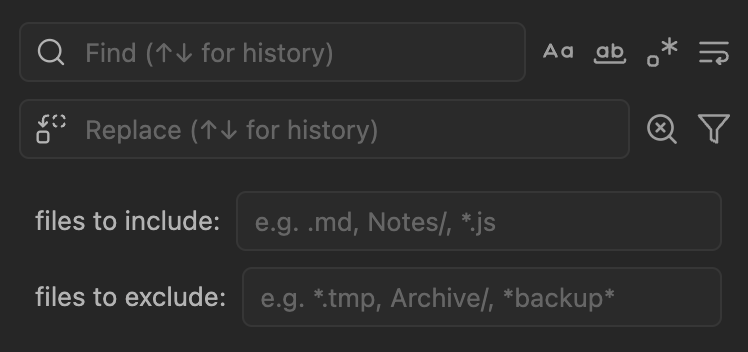

# Find-n-Replace

Vault-wide search and replace for Obsidian with regex support, multi-selection, and file filtering.



> [!CAUTION]
> This plugin modifies vault files directly. Maintain backups before bulk replacements.

## Features

- Search all text files (md, txt, js, css, json, etc.)
- Regex with capture groups (`$1`, `$2`, `$&`)
- Multiline patterns across lines
- Case-sensitive and whole-word matching
- Multi-select matches with Ctrl/Cmd+click
- File filtering by extension, folder, or glob pattern
- Search history with ↑↓ navigation
- Click results to jump to location

## Installation

[Install from community.obsidian.md](https://community.obsidian.md/plugins/find-n-replace)

From Obsidian's settings or preferences:

1. Community Plugins > Browse
2. Search for "Find-n-Replace"

Manually:

1. download the latest [release](https://github.com/gapmiss/find-n-replace/releases/latest) archive
2. uncompress the downloaded archive
3. move the `find-n-replace` folder to `/path/to/vault/.obsidian/plugins/` 
4.  Settings > Community plugins > reload **Installed plugins**
5.  enable plugin

or:

1.  download `main.js`, `manifest.json` & `styles.css` from the latest [release](https://github.com/gapmiss/find-n-replace/releases/latest)
2.  create a new folder `/path/to/vault/.obsidian/plugins/find-n-replace`
3.  move all 3 files to `/path/to/vault/.obsidian/plugins/find-n-replace`
4.  Settings > Community plugins > reload **Installed plugins**
5.  enable plugin

## Usage

1. Open via Command Palette: `Find-n-Replace: Open`
2. Enter search term (results appear as you type)
3. Optional: Click filter icon to limit by file type or folder
4. Enter replacement text
5. Replace individual matches, selected matches, or all

**Search options:** Match Case, Whole Word, Regex, Multiline

**Selection:** Ctrl/Cmd+click to multi-select, Escape to clear

## Examples

| Search | Replace | Result |
|--------|---------|--------|
| `TODO` | `DONE` | Simple text replacement |
| `(\d{4})-(\d{2})-(\d{2})` | `$2/$3/$1` | Date format conversion |
| `\[\[(.+?)\]\]` | `$1` | Remove wikilink brackets |
| `\s{2,}` | ` ` | Collapse multiple spaces |

## Commands

- Open
- Focus search/replace input
- Perform search
- Clear search and replace
- Toggle match case/whole word/regex/multiline
- Replace selected/all matches
- Select all results
- Expand/collapse all

Assign hotkeys in Settings → Hotkeys → search "Find-n-Replace"

## Settings

- **Search history**: Enable/disable, max entries (10-200)
- **Max results**: Limit displayed results (default: 1000)
- **Auto search**: Toggle search-as-you-type
- **Confirm destructive actions**: Prompt before Replace All
- **Default filters**: Set default include/exclude patterns
- **Logging level**: Silent to Trace for debugging

## Development

```bash
npm install
npm run dev      # watch mode
npm run build    # production
npm test         # run tests
```

## License

MIT
