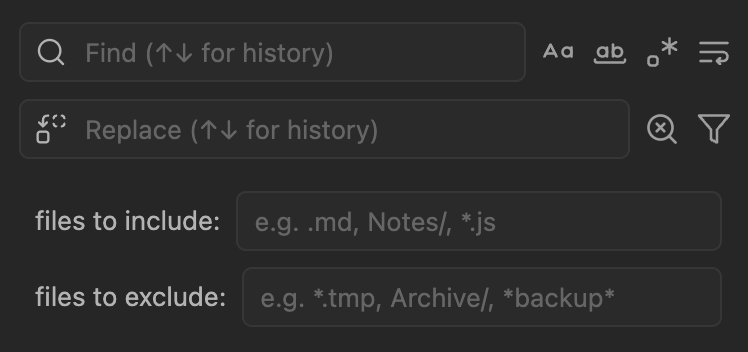

# Find-n-Replace

Vault-wide find and replace for Obsidian, modeled on the VSCode search sidebar. Supports regex with capture groups, multiline patterns, file filters, and replacing only the matches you pick.



> [!CAUTION]
> This plugin edits files in your vault directly, and replacements cannot be undone from inside the plugin. Back up your vault (or commit it to git) before running large replacements.

## Features

- Searches Markdown and other text files (`.txt`, `.js`, `.css`, `.json`, `.html`, `.csv`, and more)
- Match case, whole word, regex, and multiline toggles
- Regex replacements with `$1`, `$&`, and other capture tokens, with a live preview
- Replace one match, the matches you selected, every match in a file, or every match in the vault
- "Files to include" and "files to exclude" filters by extension, folder, or wildcard
- Search history on the ↑ and ↓ keys
- Click a result to jump to it in the editor

## Installation

Requires Obsidian 1.13.0 or later.

**From Obsidian:** open **Settings → Community plugins → Browse**, search for "Find-n-Replace", then install and enable it. You can also [view the plugin on community.obsidian.md](https://community.obsidian.md/plugins/find-n-replace).

**Manually:**

1. Download `main.js`, `manifest.json`, and `styles.css` from the [latest release](https://github.com/gapmiss/find-n-replace/releases/latest).
2. Create the folder `<your vault>/.obsidian/plugins/find-n-replace/` (use your own config folder name if you changed it from `.obsidian`).
3. Put the three files in that folder.
4. In **Settings → Community plugins**, reload the installed plugins list and enable Find-n-Replace.

## Quick start

1. Run **Find-n-Replace: Open** from the command palette.
2. Type in the search box. Results show up as you type, grouped by file.
3. Type your replacement in the replace box. Each result previews the change.
4. Replace a single match with the button on its row, every match in a file with the button on the file header, or use the **⋯** menu for **Replace selected** and **Replace all in vault**.

Ctrl/Cmd+click results to select them. Ctrl/Cmd+click a file header to select every match in that file.

The [User guide](docs/USER_GUIDE.md) covers filters, regex, multiline search, keyboard shortcuts, and every setting.

## Result limit

By default the results list shows the first 1,000 matches. When a search finds more, the count reads something like `1000 of 507370 results in 5 files (limited)`.

- The limit counts individual matches, not files. The file count is the number of files among the matches shown.
- The limit only affects what's displayed. It keeps Obsidian responsive when a search matches hundreds of thousands of times.
- **Replace all in vault** is not limited. After you confirm, it searches again without the limit and replaces every match, including ones you couldn't see.
- **Replace selected**, **Select all results**, and the per-file **Replace all in this file** button only act on the matches shown in the list. In a file that was cut off by the limit, matches past the cutoff are not replaced.
- To see more, raise **Maximum results** in the plugin settings, or narrow the search with a more specific query or with file filters.

## Examples

With **Use regex** turned on:

| Search | Replace | What it does |
|--------|---------|--------------|
| `(\d{4})-(\d{2})-(\d{2})` | `$2/$3/$1` | `2024-01-15` becomes `01/15/2024` |
| `\[\[([^\]\|]+)\]\]` | `$1` | Removes the brackets from plain wikilinks |
| ` {2,}` | ` ` (one space) | Collapses runs of spaces |
| `^- \[ \] ` | `- [x] ` | Marks open tasks as done |

## Commands

All commands are listed under "Find-n-Replace" in the command palette. None have default hotkeys. Assign your own in **Settings → Hotkeys**.

- Open
- Open help
- Perform search
- Clear search and replace
- Focus search input
- Focus replace input
- Toggle match case
- Toggle whole word
- Toggle regex
- Toggle multiline
- Toggle word-wrap in results
- Select all results
- Expand/collapse all results
- Replace selected matches
- Replace all in vault

## Help and feedback

The **⋯** menu in the plugin view has a **Help** item with commands, your current hotkeys, and a filter reference.

Report bugs or ask questions in [GitHub issues](https://github.com/gapmiss/find-n-replace/issues).

## Development

```bash
npm install
npm run dev      # rebuild on change
npm run build    # type-check and production build
npm run lint     # ESLint with eslint-plugin-obsidianmd
npm test         # Vitest
```

See [CONTRIBUTING.md](CONTRIBUTING.md) and [TESTING.md](TESTING.md).

## License

MIT
