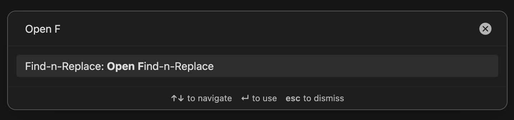

> [!NOTE]
> **Documentation Status:** Text content is complete! Screenshot placeholders (📸) will be replaced with actual images soon.


# Find-n-Replace User Guide

A comprehensive guide to using Find-n-Replace for vault-wide search and replace operations in Obsidian.

## Table of Contents

- [Getting Started](#getting-started)
- [Basic Features](#basic-features)
  - [Basic Search Workflow](#basic-search-workflow)
  - [VSCode-Style File Filtering](#vscode-style-file-filtering)
  - [Search Options](#search-options)
  - [Multi-Selection Workflow](#multi-selection-workflow)
  - [Replacement Operations](#replacement-operations)
  - [Built-in Help System](#built-in-help-system)
- [Advanced Features](#advanced-features)
  - [Regex Patterns](#regex-patterns)
  - [Multiline Search](#multiline-search)
  - [Search History Navigation](#search-history-navigation)
  - [Keyboard Navigation](#keyboard-navigation)
- [Settings Configuration](#settings-configuration)
- [Troubleshooting](#troubleshooting)

---

## Getting Started

### Opening the Plugin

Access Find-n-Replace through Obsidian's Command Palette:

1. Press `Ctrl/Cmd+P` to open the Command Palette
2. Type "Open Find"
3. Press Enter when command is highlighted

The plugin opens in a dedicated pane that can be docked anywhere in your Obsidian workspace (left sidebar, right sidebar, or as a tab).



### Understanding the Interface

The Find-n-Replace interface consists of several key areas:

1. **Search Input** - Enter your search term or regex pattern (with search icon)
2. **Replace Input** - Enter replacement text (with replace icon)
3. **Search Options Toggles** - Match Case, Whole Word, Regex, Multiline
4. **Filter Button** - Opens VSCode-style file filtering panel (shows badge when active)
5. **Toolbar Actions** - Search history, expand/collapse, help menu (⋯)
6. **Results Area** - Shows matches organized by file with collapsible groups
7. **Adaptive Toolbar** - Context-sensitive actions (Replace Selected, Replace All)

**📸 Screenshot Placeholder:** `02-getting-started-interface-overview.png`
- Show: Clean interface with all elements labeled
- Annotation: Numbered callouts for each area (1-7)
- Highlight: Key interactive elements

### Your First Search

Let's perform a simple search to find all TODO items in your vault:

1. Click in the search input field (or use `Ctrl/Cmd+Shift+F` if configured)
2. Type `TODO`
3. Results appear automatically as you type (if auto-search is enabled)
4. Press `Enter` to save "TODO" to your search history

**📸 Screenshot Placeholder:** `03-getting-started-first-search.png`
- Show: Search input with "TODO" entered, results appearing below
- Annotation: Arrow showing auto-completion, result count displayed
- Highlight: Results organized by file with match counts

### Understanding Results

Search results are organized by file, showing:

- **File name** - Clickable header to expand/collapse results
- **Match count** - Number of matches in each file (e.g., "5 results")
- **Result snippets** - Context around each match with highlighting
- **Match highlighting** - Yellow background on matched text
- **Chevron icons** - Expand (▾) or collapse (▸) file groups

**Key interactions:**
- **Click file name** - Expand or collapse results for that file
- **Click result snippet** - Navigate to that location in your vault
- **Hover on result** - Shows "Replace This" button for individual replacement

**📸 Screenshot Placeholder:** `04-getting-started-understanding-results.png`
- Show: Results with some files expanded, others collapsed
- Annotation: Labels for file headers, match counts, snippets
- Highlight: Hover state showing replace button

---

## Basic Features

### Basic Search Workflow

The recommended workflow for searching:

1. **(Optional)** Configure file filters to limit search scope
2. Enter search term in the search input field
3. Results populate automatically as you type (with debouncing)
4. Press `Enter` to add search to history (enables ↑↓ navigation)
5. Browse results organized by file
6. Click any result to navigate to that location
7. Use **X button** to clear search input when done

**Clear Input Buttons:**
All text inputs (search, replace, include/exclude filters) feature contextual clear buttons (X icon) that:
- Appear when content is present
- Disappear when empty
- Maintain proper focus after clearing
- Work with keyboard (Escape key)

**Auto-Search Behavior:**
- **Enabled** (default): Results update as you type (300ms debounce)
- **Disabled**: Press Enter to trigger search

Configure in Settings → Find-n-Replace → "Enable Auto Search"

**📸 Screenshot Placeholder:** `05-basic-search-clear-button.png`
- Show: Search input with content and visible X button
- Annotation: Close-up of clear button, note about keyboard shortcut
- Highlight: Before/after showing clear action

### VSCode-Style File Filtering

Click the **🔍 filter button** to open the expandable filter panel with two input fields:

#### Files to Include

Limit search to specific file types, folders, or glob patterns.

**Note:** By default, the plugin searches **all text-based files** in your vault (`.md`, `.txt`, `.js`, `.css`, `.json`, `.ts`, `.yaml`, `.xml`, and more). Use filters to narrow the scope for better performance or focused searches.

**Pattern Types:**
- **Extensions**: `.md`, `.txt`, `.js` - Search only these file types
- **Folders**: `Notes/`, `Daily/`, `Projects/` - Search only in these folders
- **Glob patterns**: `*.md`, `Projects/**/*.txt` - Advanced matching
- **Combinations**: `.md, Projects/` - Multiple patterns (comma-separated)

**Examples:**

```
.md, .txt                    → Only markdown and text files
Notes/, Daily/               → Only Notes and Daily folders
.md, Projects/               → Only markdown files in Projects folder
Projects/**/*.md             → All markdown in Projects and subfolders
```

#### Files to Exclude

Skip specific files, folders, or patterns:

**Pattern Types:**
- **Extensions**: `*.tmp`, `*.bak` - Exclude temporary/backup files
- **Folders**: `Archive/`, `Templates/` - Skip entire folders
- **Glob patterns**: `*backup*`, `temp/*` - Pattern matching
- **Combinations**: `Archive/, *.tmp` - Multiple exclusions

**Examples:**

```
*.tmp, *backup*              → Skip temporary and backup files
Archive/, Templates/         → Skip Archive and Templates folders
temp/*, *.log                → Skip temp folder and log files
Archive/, *.tmp, *draft*     → Multiple exclusion patterns
```

**Session-Only Behavior:**
- Filter changes are **temporary** - they don't modify plugin settings
- Settings provide **default values** when opening the view
- Close and reopen the view to load fresh defaults from settings
- To change defaults: Update Settings → File Filtering → Reopen view

**Filter Badge:**
When filters are active, the filter button shows a visual indicator (badge or border color change).

**📸 Screenshot Placeholder:** `06-basic-file-filtering-expanded.png`
- Show: Filter panel expanded with example patterns in both fields
- Annotation: Labels for "files to include" and "files to exclude"
- Highlight: Filter button showing active state with badge
- Note: Clear buttons visible on both filter inputs

### Search Options

Four toggle buttons control search behavior:

#### Match Case (Aa)

**Disabled** (default): Case-insensitive search
- `TODO` matches: "TODO", "todo", "Todo", "tOdO"

**Enabled**: Case-sensitive search
- `TODO` matches: only "TODO" (exact case)

**Use when:** You need to distinguish between "ID", "id", and "Id"

#### Whole Word (⌘)

**Disabled** (default): Match partial words
- `test` matches: "test", "testing", "retest", "latest"

**Enabled**: Match complete words only (adds word boundaries `\b`)
- `test` matches: only "test" (standalone word)

**Use when:** Searching for variable names, avoiding partial matches

#### Use Regex (.*)

**Disabled** (default): Literal text search
- `a.b` matches: only the literal string "a.b"

**Enabled**: JavaScript regular expression syntax
- `a.b` matches: "a.b", "aab", "a1b", "axb" (any character between a and b)

**Use when:** You need pattern matching, capture groups, or advanced searches

**See:** [Regex Patterns](#regex-patterns) section for detailed guide

#### Multiline (⤓)

**Disabled** (default): Line-by-line search (better performance)
- Patterns match within single lines only

**Enabled**: Cross-line pattern matching
- Patterns can span multiple lines using `\n`
- Enables `^` (start) and `$` (end) anchors to match line boundaries
- Required for searching content that spans lines

**Use when:** Searching for patterns that cross line breaks

**See:** [Multiline Search](#multiline-search) section for examples

**Toggle State Memory:**
In Settings → User Experience → "Remember Search Options" (default: disabled)
- **Enabled**: Toggle states persist across Obsidian sessions
- **Disabled**: Toggles reset to defaults when reopening plugin

**📸 Screenshot Placeholder:** `07-basic-search-options-toggles.png`
- Show: All four toggle buttons with labels and icons
- Annotation: Describe each toggle with on/off states
- Highlight: Visual difference between active (accent color) and inactive states

### Multi-Selection Workflow

Select specific matches for targeted replacements:

#### Selection Methods

**Individual Selection:**
- `Ctrl/Cmd+Click` on any result → Toggle that match
- Selected matches show purple gradient background

**Bulk Selection:**
- `Ctrl/Cmd+A` → Select all visible results
- **File header action** → Select all matches in that file (via ellipsis menu)

**Clear Selection:**
- `Escape` key → Deselect all matches
- Click ellipsis menu (⋯) → "Clear Selection"

#### Selection Features

**Visual Indicators:**
- Selected matches: Purple gradient background
- Selection count: Shows "X selected" in adaptive toolbar
- Persistent state: Selections maintained when editing replace text

**Selection Workflow:**
1. Perform search to see all matches
2. `Ctrl/Cmd+Click` to select specific matches (or `Ctrl/Cmd+A` for all)
3. Selection count updates in toolbar
4. Edit replace text - selections persist
5. Preview shows changes only for selected matches
6. Click "Replace Selected" to replace only selected matches

**Pro Tip:** Selections remain active when you modify the replacement text, so you can preview changes before executing.

**📸 Screenshot Placeholder:** `08-basic-multi-selection.png`
- Show: Multiple results selected (purple background) with selection count
- Annotation: Arrows showing Ctrl/Cmd+Click action, selection count in toolbar
- Highlight: Visual difference between selected and unselected results

### Replacement Operations

Four modes for replacing content:

#### 1. Replace This (Individual)

**When:** Replace a single match
**How:** Hover over any result → Click replace icon (appears on hover)
**Behavior:** Replaces only that one match, updates file immediately

**Use case:** Cherry-picking specific matches after review

#### 2. Replace Selected

**When:** Replace multiple specific matches
**How:** Select matches with Ctrl/Cmd+Click → Click "Replace Selected" button
**Behavior:** Replaces all selected matches across all files

**Use case:** Targeted replacements after manual review

#### 3. Replace All in File

**When:** Replace all matches in a specific file
**How:** Click ellipsis menu (⋯) on file header → "Replace All in File"
**Behavior:** Replaces all matches in that file only

**Use case:** File-specific updates without affecting other files

#### 4. Replace All in Vault

**When:** Replace all matches everywhere
**How:** Click "Replace All in Vault" button (ellipsis menu in toolbar)
**Behavior:** Replaces all matches across entire vault

**Confirmation:** If "Confirm Destructive Actions" is enabled (default), shows confirmation modal before executing

**Use case:** Confident bulk replacements after thorough preview

**Replacement Preview:**
Before replacing, all modes show live preview:
- **Original text**: Red strikethrough with red background
- **Replacement text**: Green text with green background
- **Regex capture groups**: Expanded in preview (e.g., `$1` → actual captured content)

**Safety Features:**
- Confirmation modal for vault-wide replacements (configurable)
- Incremental result updates (no full re-search after replacement)
- Atomic file operations (all-or-nothing writes)
- Graceful error handling with user notifications

**📸 Screenshot Placeholder:** `09-basic-replacement-operations.png`
- Show: All four replacement modes with UI elements highlighted
- Annotation: Numbered callouts for each mode (1-4)
- Highlight: Replace preview showing red strikethrough and green replacement
- Note: Confirmation modal example

### Built-in Help System

Access comprehensive help directly in the plugin:

**Opening Help:**
1. Click ellipsis menu (⋯) in toolbar
2. Select "Help" from dropdown

**Help Modal Contents:**

#### Available Commands

- Table showing all 13 plugin commands with descriptions
- Your configured hotkeys displayed next to each command
- "Not set" indicator for commands without hotkeys
- Recommended hotkey suggestions

**Commands include:**
- View Management (Open, Focus Search, Focus Replace)
- Search Operations (Perform Search, Clear, Toggle options)
- Replace Operations (Replace Selected, Replace All)
- Result Management (Select All, Expand/Collapse)

#### File Filtering Guide

Complete documentation for include/exclude patterns with:

- Pattern types explained (extensions, folders, globs)
- Real-world examples for each pattern type
- Common use cases with copy-paste ready patterns
- Performance optimization tips

#### Keyboard Shortcuts

- Navigation shortcuts (Tab, Enter, Space)
- Selection shortcuts (Ctrl/Cmd+A, Escape, Ctrl/Cmd+Click)
- Search history navigation (↑↓ arrows)
- Input clearing (Escape key)

#### Usage Tips

- Clear-input button usage
- Search history workflow
- Performance optimization suggestions
- Quick workflow tips

#### Hotkey Configuration Link

Direct link to Obsidian Settings → Hotkeys to configure custom shortcuts

**📸 Screenshot Placeholder:** `10-basic-help-modal.png`
- Show: Help modal open with commands table visible
- Annotation: Point out hotkey assignments (set vs. not set)
- Highlight: File filtering guide section, keyboard shortcuts table
- Note: Clean, organized presentation with individual `<kbd>` tag styling

---

## Advanced Features

### Regex Patterns

Regular expressions enable powerful pattern matching and text transformation.

#### Enabling Regex Mode

1. Click the `.*` toggle button (Use Regex)
2. Button shows accent color when enabled
3. Search input now accepts regex patterns
4. Invalid patterns show error messages

#### Basic Regex Syntax

**Literal characters:**
- `abc` → Matches exactly "abc"

**Special characters** (must be escaped with `\`):
- `.` (any character) → Use `\.` for literal period
- `*` (zero or more) → Use `\*` for literal asterisk
- `+` (one or more) → Use `\+` for literal plus
- `?` (optional) → Use `\?` for literal question mark
- `[` `]` `(` `)` `{` `}` `|` `^` `$` → Escape these in literal searches

**Character classes:**
- `.` → Any single character
- `\d` → Any digit (0-9)
- `\w` → Any word character (a-z, A-Z, 0-9, _)
- `\s` → Any whitespace (space, tab, newline)
- `[abc]` → Any character in set (a, b, or c)
- `[^abc]` → Any character NOT in set
- `[a-z]` → Any lowercase letter
- `[0-9]` → Any digit

**Quantifiers:**
- `*` → Zero or more times
- `+` → One or more times
- `?` → Zero or one time (optional)
- `{3}` → Exactly 3 times
- `{2,5}` → Between 2 and 5 times
- `{3,}` → 3 or more times

**Anchors:**
- `^` → Start of line (requires Multiline mode)
- `$` → End of line (requires Multiline mode)
- `\b` → Word boundary

**Groups:**
- `(...)` → Capture group (can be referenced in replacement)
- `(?:...)` → Non-capturing group (for grouping only)

#### Capture Groups and Replacements

Capture groups allow you to extract parts of the match and reuse them:

**Basic Example - Date Format Conversion:**

```
Search:  (\d{4})-(\d{2})-(\d{2})
Replace: $2/$3/$1

Matches: "2024-01-15"
Result:  "01/15/2024"

Explanation:
  $1 = first group = "2024" (year)
  $2 = second group = "01" (month)
  $3 = third group = "15" (day)
```

**Special Replacement Tokens:**
- `$1`, `$2`, ... → Captured groups (1-indexed)
- `$&` → Entire match
- `$\`` → Text before match
- `$'` → Text after match
- `$$` → Literal dollar sign

**Live Preview:**
The replacement preview shows actual expanded capture groups before execution, with:
- Red strikethrough for original text
- Green highlighting for replacement text
- Capture groups expanded to show actual values

#### Common Regex Examples

**Example 1: Find all wikilinks**

```
Search: \[\[([^\]]+)\]\]
Matches: [[Link]], [[Another Link]], [[File|Alias]]
Use: Locate all internal links for review
```

**Example 2: Convert markdown links to wikilinks**

```
Search:  \[([^\]]+)\]\(([^)]+)\)
Replace: [[$1|$2]]

Matches: [Display Text](url)
Result:  [[Display Text|url]]
```

**Example 3: Remove multiple spaces**

```
Search:  \s{2,}
Replace: (single space)

Matches: "word    word", "line   end"
Result:  "word word", "line end"
```

**Example 4: Standardize heading formats**

```
Search:  ^#+\s*(.+?)\s*#+\s*$
Replace: ## $1

Matches: "### Title ###", "#Title#", "#### Section ####"
Result:  "## Title", "## Title", "## Section"
```

**Example 5: Extract and reformat tags**

```
Search:  #([a-z0-9-]+)
Replace: [[tags/$1]]

Matches: #projectname, #todo, #in-progress
Result:  [[tags/projectname]], [[tags/todo]], [[tags/in-progress]]
```

**Example 6: Find email addresses**

```
Search: \b[A-Za-z0-9._%+-]+@[A-Za-z0-9.-]+\.[A-Z|a-z]{2,}\b
Matches: user@example.com, john.doe+tag@domain.co.uk
Use: Locate all email addresses for review
```

#### Regex Troubleshooting

**Pattern not matching:**
- Verify regex syntax using online testers (regex101.com, regexr.com)
- Check that special characters are properly escaped
- Ensure Multiline mode is enabled for `^` and `$` anchors
- Test pattern on single file first before vault-wide search

**Invalid regex error:**
- Check for unmatched parentheses `(` `)` or brackets `[` `]`
- Verify escape sequences are valid
- Ensure quantifiers `{n,m}` have valid numbers

**Capture group issues:**
- Capture groups are 1-indexed: `$1`, `$2`, `$3`, etc.
- Verify group numbering in replacement pattern
- Use preview to see expanded capture groups before replacing

**Performance issues:**
- Avoid catastrophic backtracking (e.g., `(.+)*`, `(a+)+b`)
- Use specific patterns instead of greedy wildcards
- Enable file filtering to limit search scope
- Regex timeout protection: Patterns that take >5 seconds are automatically canceled

**📸 Screenshot Placeholder:** `11-advanced-regex-patterns.png`
- Show: Regex search with date format pattern and live preview
- Annotation: Highlight capture groups in search, expanded groups in preview
- Highlight: Red/green replacement preview with capture group substitution
- Note: Before/after example showing actual values

### Multiline Search

Search for patterns that span multiple lines.

#### Enabling Multiline Mode

Requirements:

1. Enable **Use Regex** toggle (.*) first
2. Enable **Multiline** toggle (⤓)
3. Both toggles show accent color when active

**Behavior Change:**
- **Line-by-line mode** (default): Patterns match within single lines only
- **Multiline mode**: Patterns can match across line breaks using `\n`, `^`, `$`

#### Multiline Pattern Syntax

**Matching line breaks:**
- `\n` → Literal newline character
- `\r\n` → Windows line ending
- `\s` → Any whitespace including newlines

**Anchors in multiline mode:**
- `^` → Start of any line
- `$` → End of any line
- `\A` → Start of entire content
- `\Z` → End of entire content

#### Multiline Examples

**Example 1: TODO items with details**

```
Regex + Multiline enabled:
Search:  (TODO:.*)\n(.*)
Replace: - [ ] $1\n  $2

Matches:
  TODO: Fix the bug
  Details about the bug

Result:
  - [ ] TODO: Fix the bug
    Details about the bug
```

**Example 2: Remove empty lines after headings**

```
Regex + Multiline enabled:
Search:  (^##.+)\n\n+
Replace: $1\n

Matches:
  ## Heading


  Content

Result:
  ## Heading
  Content
```

**Example 3: Find code blocks**

`````
Regex + Multiline enabled:
Search: ```(\w+)\n([\s\S]*?)\n```

Matches:
  ```javascript
  function example() {
    return true;
  }
  ```

Result: Captures language and entire code block content
`````

**Example 4: Combine consecutive list items**

```
Regex + Multiline enabled:
Search:  ^- (.*)\n- (.*)$
Replace: - $1; $2

Matches:
  - First item
  - Second item

Result:
  - First item; Second item
```

**Example 5: Find paragraphs with specific structure**

```
Regex + Multiline enabled:
Search: ^(.*TODO.*)\n\n(.*completed.*)$

Matches:
  Line with TODO

  Line with completed

Use: Find TODO items that are marked completed
```

#### Multiline Preview

Multiline matches show in results with:

- **Truncated display**: First 50 characters with "..." if longer
- **Line breaks visible**: `\n` shown as actual breaks in snippets
- **Full content on hover**: Tooltip shows complete match
- **Replacement preview**: Shows multiline replacement with proper formatting

#### Multiline Performance

**Performance Considerations:**
- Multiline search processes entire file content (not line-by-line)
- Slower than line-by-line mode for large files
- Use file filtering to limit search scope
- Specific patterns perform better than greedy quantifiers

**Best Practices:**
- Test patterns on single file first
- Use specific patterns instead of `[\s\S]*` when possible
- Limit search scope with file filters
- Monitor console for performance warnings (if logging enabled)

**📸 Screenshot Placeholder:** `12-advanced-multiline-search.png`
- Show: Multiline toggle enabled, search with `\n` pattern
- Annotation: Show pattern matching across lines in results
- Highlight: Result snippet displaying line breaks, truncation
- Note: Full content tooltip on hover

### Search History Navigation

Navigate previous search and replace patterns using keyboard shortcuts.

#### How Search History Works

**Saving to History:**
- Press `Enter` in search or replace input
- Pattern is added to history (if not duplicate of most recent entry)
- History persists across Obsidian sessions

**Navigating History:**
- `↑` (Up arrow) → Previous pattern (older)
- `↓` (Down arrow) → Next pattern (newer)
- `Escape` → Exit history mode, restore current input

**History Capacity:**
- Default: 50 entries for search, 50 for replace
- Configurable: 10-200 entries in settings
- LRU cache: Oldest entries removed when limit reached

#### Using History

**Search History Workflow:**
1. Focus search input (click or use hotkey)
2. Press `↑` to cycle through previous searches
3. Press `↓` to go back to newer searches
4. Press `Enter` to execute search and save current pattern
5. Press `Escape` to exit history and restore typed input

**Replace History Workflow:**
1. Focus replace input
2. Use `↑`/`↓` to navigate previous replacements
3. Edit if needed
4. Press `Enter` to confirm (pattern saved to history)

**Visual Indicators:**
- Input content changes as you navigate
- Current position in history (not visually shown, but navigable)
- Original typed content restored on `Escape`

#### History Management

**Settings Configuration:**
Location: Settings → Find-n-Replace → Search history

- **Enable Search History**: Toggle feature on/off (default: enabled)
- **Maximum History Entries**: Set capacity 10-200 (default: 50)
- **Clear All History**: Button to delete all saved patterns

**When to Clear History:**
- Accumulated too many old patterns
- Want to start fresh
- Privacy concerns (patterns saved in plugin data)

**Pro Tips:**
- Build a library of common regex patterns in history
- Increase max entries to 200 for extensive pattern library
- Use history for frequently repeated searches
- Navigate history first before typing new patterns

**📸 Screenshot Placeholder:** `13-advanced-search-history.png`
- Show: Search input focused with arrow indicating ↑↓ navigation
- Annotation: Show history entries being cycled through
- Highlight: Settings panel showing history configuration
- Note: Visual cue for history navigation (text changes)

### Keyboard Navigation

Complete keyboard accessibility for efficient workflows.

#### Sequential Tab Order

Press `Tab` to navigate through interactive elements in order:

1. **Search input** → Type search pattern
2. **Replace input** → Type replacement text
3. **Toggle buttons** → Match Case, Whole Word, Regex, Multiline
4. **Filter button** → Open/close filter panel
5. **Toolbar actions** → Ellipsis menu, expand/collapse
6. **Filter inputs** (if panel open) → Include and exclude patterns
7. **Results container** → Focus on result list
8. **File headers** → Expand/collapse file groups
9. **Individual results** → Navigate to specific matches
10. **Replace buttons** → Execute replacement actions

**Reverse Navigation:**
- `Shift+Tab` → Navigate backward through elements
- Plugin boundary: Tab navigation stays within plugin (doesn't escape to Obsidian UI)

#### Action Shortcuts

**In Search/Replace Inputs:**
- `Enter` → Execute search, save to history
- `↑`/`↓` → Navigate search history
- `Escape` → Clear input or exit history mode

**In Results Container:**
- `Enter`/`Space` → Open file at result location
- `Ctrl/Cmd+A` → Select all results
- `Escape` → Clear all selections

**On File Headers:**
- `Enter`/`Space` → Expand or collapse file group
- `Tab` → Navigate to next file or into results

**On Replace Buttons:**
- `Enter`/`Space` → Execute replace action

#### Focus Management

**Focus Indicators:**
- Blue outline on focused elements
- Larger touch targets for buttons (24x24px minimum)
- Clear visual feedback on hover and focus

**Focus Restoration:**
- After clearing input with X button, focus remains in input
- After replacement, focus returns to results
- After navigation to file, focus returns to plugin on reopen

#### Keyboard Shortcuts Summary

| Action | Shortcut | Context |
|--------|----------|---------|
| Open plugin | (Configure in Hotkeys) | Anywhere |
| Focus search input | (Configure in Hotkeys) | Plugin view |
| Focus replace input | (Configure in Hotkeys) | Plugin view |
| Execute search | `Enter` | Search/replace input |
| Clear input | `Escape` | Search/replace input |
| Navigate history | `↑`/`↓` | Search/replace input |
| Select all results | `Ctrl/Cmd+A` | Results area |
| Clear selections | `Escape` | Results area |
| Toggle selection | `Ctrl/Cmd+Click` | Individual result |
| Navigate forward | `Tab` | Anywhere in plugin |
| Navigate backward | `Shift+Tab` | Anywhere in plugin |
| Activate element | `Enter`/`Space` | Focused element |

**Configuring Hotkeys:**
1. Open Obsidian Settings → Hotkeys
2. Search for "Find-n-Replace"
3. Assign preferred key combinations to 13 available commands
4. Recommended hotkeys shown in help modal

**Accessibility Features:**
- Screen reader support with ARIA labels
- Clear focus indicators
- Logical tab order
- Keyboard-accessible replacements (no mouse required)
- Event isolation prevents interference with other plugins

**📸 Screenshot Placeholder:** `14-advanced-keyboard-navigation.png`
- Show: Focused element with blue outline, tab order visualization
- Annotation: Arrows showing sequential tab flow
- Highlight: Keyboard shortcut overlay showing available actions
- Note: Accessibility indicators (ARIA labels, focus targets)

---

## Settings Configuration

Configure Find-n-Replace behavior in Obsidian Settings.

### Accessing Settings

1. Open Obsidian Settings (gear icon)
2. Navigate to Community Plugins → Find-n-Replace
3. Settings panel shows all configuration options

### Settings Sections

#### Search History

**Enable Search History**
- Toggle: ON (default) / OFF
- Description: Enable ↑↓ arrow key navigation in search/replace inputs
- Effect: When disabled, history is not saved or accessible

**Maximum History Entries**
- Range: 10-200
- Default: 50
- Description: Number of patterns to remember (search and replace separately)
- Effect: Oldest entries removed when limit reached (LRU cache)

**Clear All History**
- Button: Clears all saved search and replace patterns
- Confirmation: No confirmation modal (immediate action)
- Effect: Cannot be undone - history deleted permanently

#### Core Settings

**Max Results**
- Range: 100-10000
- Default: 1000
- Description: Maximum search results to display
- Effect: Prevents UI freezing with large result sets
- Notification: User notified when limit reached

**Search Debounce Delay**
- Range: 0-1000 milliseconds
- Default: 300ms
- Description: Delay before auto-search triggers
- Effect: Lower = faster but more searches; Higher = less responsive but fewer operations

**Enable Auto Search**
- Toggle: ON (default) / OFF
- Description: Automatically search as you type
- Effect: When disabled, press Enter to trigger search manually

#### User Experience

**Confirm Destructive Actions**
- Toggle: ON (default) / OFF
- Description: Show confirmation modal before "Replace All in Vault"
- Effect: When disabled, vault-wide replacements execute immediately (risky)

**Remember Search Options**
- Toggle: OFF (default) / ON
- Description: Persist toggle states (Match Case, Whole Word, Regex, Multiline)
- Effect: When enabled, toggles remember last used state across sessions

**Remember File Group States Across Restarts**
- Toggle: ON (default) / OFF
- Description: Save expand/collapse state to disk
- Effect: When enabled, file groups remain expanded/collapsed across restarts; When disabled, groups reset each session

#### File Filtering (VSCode-Style Defaults)

**Default files to include**
- Input field: Comma-separated patterns
- Example: `.md,.txt` or `Notes/,Projects/` or `*.js`
- Description: Default patterns for "files to include" input
- Effect: Populates include filter when opening plugin view (session-only)

**Default files to exclude**
- Input field: Comma-separated patterns
- Example: `*.tmp,*backup*` or `Archive/,Templates/`
- Description: Default patterns for "files to exclude" input
- Effect: Populates exclude filter when opening plugin view (session-only)

**How Default Filters Work:**
- Settings populate filter inputs when opening view
- Filter input changes are **session-only** (temporary)
- Close and reopen view to reload defaults from settings
- Leave settings empty for no default filters

#### Troubleshooting

**Console Logging Level**
- Dropdown: Silent / Errors Only / Standard / Verbose / Debug / Trace
- Default: Errors Only
- Description: Granular control over console output
- Effect: Higher levels show more detailed debugging information

**Levels Explained:**
- **Silent**: No console output (production)
- **Errors Only**: Critical failures only (recommended default)
- **Standard**: Errors and warnings
- **Verbose**: All info, warnings, and errors
- **Debug**: Full debugging with operation tracking
- **Trace**: Maximum verbosity with performance timing

### Recommended Settings

**For Small Vaults (<1000 files):**
- Max Results: 1000 (default)
- Search Debounce: 300ms (default)
- Auto Search: Enabled
- File Filtering: None

**For Large Vaults (>5000 files):**
- Max Results: 500-1000
- Search Debounce: 500ms
- Auto Search: Enabled
- File Filtering: Use include patterns to limit scope

**For Power Users:**
- Max History: 100-200
- Remember Search Options: Enabled
- Console Logging: Debug (when troubleshooting)
- Confirm Destructive Actions: Disabled (if confident)

**For Beginners:**
- All defaults (recommended)
- Confirm Destructive Actions: Enabled
- Console Logging: Errors Only
- Auto Search: Enabled

---

## Troubleshooting

### No Results

**Problem:** Search returns no results, but content exists

**Solutions:**

1. **Check file filters:**
   - Open filter panel (🔍 button)
   - Verify "files to include" includes target file types
   - Remove overly restrictive patterns
   - Clear exclude patterns that might block files

2. **Verify search pattern:**
   - If Regex is enabled, check pattern syntax
   - If Whole Word is enabled, ensure searching for complete words
   - If Match Case is enabled, verify case matches
   - Try disabling all toggles for basic literal search

3. **Check file accessibility:**
   - Ensure files are readable (not corrupted)
   - Verify files are in vault directory
   - Check console for "file read failed" errors (if logging enabled)

4. **Multiline mode mismatch:**
   - If searching for content across lines, enable Multiline mode
   - If Multiline is enabled unnecessarily, disable it

### Slow Performance

**Problem:** Searches take too long or UI freezes

**Solutions:**

1. **Enable file filtering:**
   - Limit search to specific file types or folders
   - Exclude large folders (e.g., Archive, Attachments)
   - Use specific patterns instead of searching entire vault

2. **Reduce max results:**
   - Settings → Core settings → Max Results: 500 or lower
   - Accepts truncation for faster results

3. **Optimize search patterns:**
   - Avoid greedy regex quantifiers (`.*`, `.+`)
   - Use specific patterns instead of wildcards
   - Disable Multiline mode if not needed

4. **Check vault size:**
   - Large vaults (>10,000 files) benefit most from filtering
   - Consider searching specific folders instead of entire vault

5. **Increase debounce delay:**
   - Settings → Search Debounce Delay: 500-1000ms
   - Reduces number of searches triggered while typing

### Regex Troubleshooting

**Problem:** Regex pattern not working as expected

**Solutions:**

1. **Validate syntax:**
   - Test pattern on regex101.com or regexr.com
   - Check for unmatched parentheses or brackets
   - Verify escape sequences are correct

2. **Enable Multiline for anchors:**
   - If using `^` or `$`, enable Multiline mode
   - Multiline mode required for line-boundary matching

3. **Check capture groups:**
   - Capture groups are 1-indexed: `$1`, `$2`, etc. (not `$0`)
   - Use preview to verify capture group expansion
   - Non-capturing groups `(?:...)` don't create numbered references

4. **Escape special characters:**
   - Escape: `. * + ? [ ] ( ) { } | ^ $ \`
   - Use `\.` for literal period, `\*` for literal asterisk, etc.

5. **Regex timeout:**
   - Patterns taking >5 seconds are automatically canceled
   - Simplify pattern to avoid catastrophic backtracking
   - Avoid: `(.+)*`, `(a+)+b`, `(a*)*b` (greedy nested quantifiers)

### Selection Issues

**Problem:** Selections not behaving correctly

**Solutions:**

1. **Clear and re-select:**
   - Press `Escape` to clear all selections
   - Re-select desired matches with `Ctrl/Cmd+Click`

2. **Avoid clicking during search:**
   - Wait for search to complete before selecting
   - Active searches may reset selection state

3. **Check console for warnings:**
   - If logging enabled, check for selection state warnings
   - Settings → Console Logging Level: Debug

4. **Verify selection persistence:**
   - Selections should persist when editing replace text
   - If selections clear unexpectedly, report as bug

### Replacement Issues

**Problem:** Replacements not working or producing unexpected results

**Solutions:**

1. **Verify replacement preview:**
   - Check preview before executing (red → green)
   - Ensure capture groups are expanding correctly
   - Test on single match first (hover → Replace This)

2. **Check file permissions:**
   - Ensure files are writable (not read-only)
   - Verify vault has write access
   - Check console for "file modify failed" errors

3. **Use smaller scope:**
   - Test with "Replace This" on single match first
   - If successful, try "Replace All in File"
   - Use "Replace All in Vault" only when confident

4. **Verify regex replacement tokens:**
   - `$1`, `$2` for capture groups (1-indexed)
   - `$&` for entire match
   - `$$` for literal dollar sign

### Getting More Help

**Check Console Logs:**
1. Settings → Console Logging Level: Debug or Trace
2. Open Developer Console: `Ctrl/Cmd+Shift+I` → Console tab
3. Reproduce issue
4. Check for error messages or warnings

**Report Bugs:**
- GitHub Issues: [gapmiss/find-n-replace/issues](https://github.com/gapmiss/find-n-replace/issues)
- Include: Plugin version, Obsidian version, console errors, steps to reproduce

**Community Support:**
- GitHub Discussions: [gapmiss/find-n-replace/discussions](https://github.com/gapmiss/find-n-replace/discussions)
- Obsidian Forum: Search for "Find-n-Replace"

---

**Next Steps:**
- Explore [Workflows](WORKFLOWS.md) for real-world examples
- Learn [Tips & Tricks](TIPS_AND_TRICKS.md) for power user features
- Configure [Settings](#settings-configuration) for your workflow

---

*User Guide Version 1.0.1 - Last updated: 2025-11-05*
